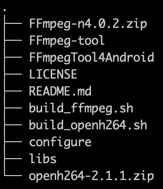

# FFmpeg_Build4Android
Build FFmpeg for Android with cross compile chain

**我的相关博客**

[Android FFmpeg 编译可执行命令程序(依赖动态库)](https://blog.csdn.net/u011520181/article/details/107357250)

[FFmpeg 增加自定义协议读取 Android InputStream](https://blog.csdn.net/u011520181/article/details/113546508)

#### 编译 ffmpeg_toos.so 步骤：

1. **准备 FFmpeg 源码：**

   i. 下载 [FFmpeg-n4.0.2](https://github.com/FFmpeg/FFmpeg/releases/tag/n4.0.2) 源码并解压到当前目录(build_android.sh 所在目录)

   ii. 用当前目录下的 configure 替换掉  FFmpeg-n4.0.2 目录下的 configure

   ```shell
   configure 中实际上只做下面修改： #line 6014
   # enabled libopenh264       && require_pkg_config libopenh264 openh264 wels/codec_api.h WelsGetCodecVersion
   替换成：
   enabled libopenh264       && require  libopenh264 wels/codec_api.h WelsGetCodecVersion -lopenh264 -lm -lstdc++
   ```

2. **准备 openh264 源码：**

   下载 [openh264-2.1.1](https://github.com/cisco/openh264/releases/tag/v2.1.1) 并解压到当前目录

3. **编译 openh264**

   - 打开 build_openh264.sh，设置 ANDROID_SDK 和 ANDROID_NDK
   - 在命令行进入项目根目录，执行 ./build_android.sh
   - 输出的结果在项目根目录下的 libs/openh264-out 下

4. **编译 ffmpeg**

   - 打开 build_ffmpeg.sh，设置 ANDROID_SDK 和 ANDROID_NDK
   - 在命令行进入项目根目录，执行 ./build_ffmpeg.sh
   - 输出的结果在项目根目录下的  libs/ffmpeg-out 下

5. **编译 ffmpeg_tools**

   - 打开 FFmpeg-tool/build_ffmpeg_tool.sh，设置 ANDROID_SDK 和 ANDROID_NDK
   - 将第 4 步中 libs/ffmpeg-out 下的各 armeabi 下的 libffmpeg.so 拷贝到 FFmpeg-tool/ffmpeg/libs 下
   - 在命令行进入 FFmpeg-tool 目录，执行 ./build_ffmpeg_tool.sh
   - 输出的结果在项目根目录下的   FFmpeg-tool/output 下

6. **ffmpeg_tool  adb 测试**

   ```shell
   # 将 libffmpeg_tool.so 和 libffmpeg.so 放到 /data/local/tmp 目录
   adb push libffmpeg_tool.so /data/local/tmp
   adb push libffmpeg.so /data/local/tmp
   # adb shell 并进入 /data/local/tmp 目录
   adb shell
   cd /data/local/tmp
   # 给 libffmpeg_tool.so 赋予可执行权限
   chmod +x libffmpeg_tool.so
   # 增加链接库路径（因为 libffmpeg_tool.so 执行时需要依赖 libffmpeg.so，不加这个会报错找不到 libffmpeg.so）
   export LD_LIBRARY_PATH=/data/local/tmp:$LD_LIBRARY_PATH
   ./libffmpeg_tool.so -i /sdcard/Alan/ffmpeg/test.mp4
   ```

7. **ffmpeg_tool Android 项目中测试**

   ```java
   // 把 libffmpeg.so 和 libffmpeg_tool.so(由 ffmpeg_tool 重命名)放到 libs 目录下打包到 APK
   // 在使用 ProcessBuilder 执行命令行时需加上环境变量，否则执行命令的时候会找不到 libffmpeg.so：
   private Process exec(String cmd) throws IOException {
           String filepath = getSoFilePath();
           if (!TextUtils.isEmpty(filepath)) {
               String nativeLibrariesPath = mContext.getApplicationContext().getApplicationInfo().nativeLibraryDir;
               Log.e(TAG ," nativeLibrariesPath = " + nativeLibrariesPath);

               ProcessBuilder processBuilder = new ProcessBuilder();
               Map<String, String> envMap = processBuilder.environment();
               envMap.put("LD_LIBRARY_PATH", nativeLibrariesPath);

               String _cmd = String.format("%s %s", filepath, cmd);
               Log.d(TAG, "_cmd:" + _cmd);
               String[] commands = { "sh", "-c", _cmd };
               processBuilder.command(commands);

               return processBuilder.start();
           }
           return null;
       }
   ```

- 注：以上项目根目录均指 README 所在目录

- 当前目录结构如下：

  

